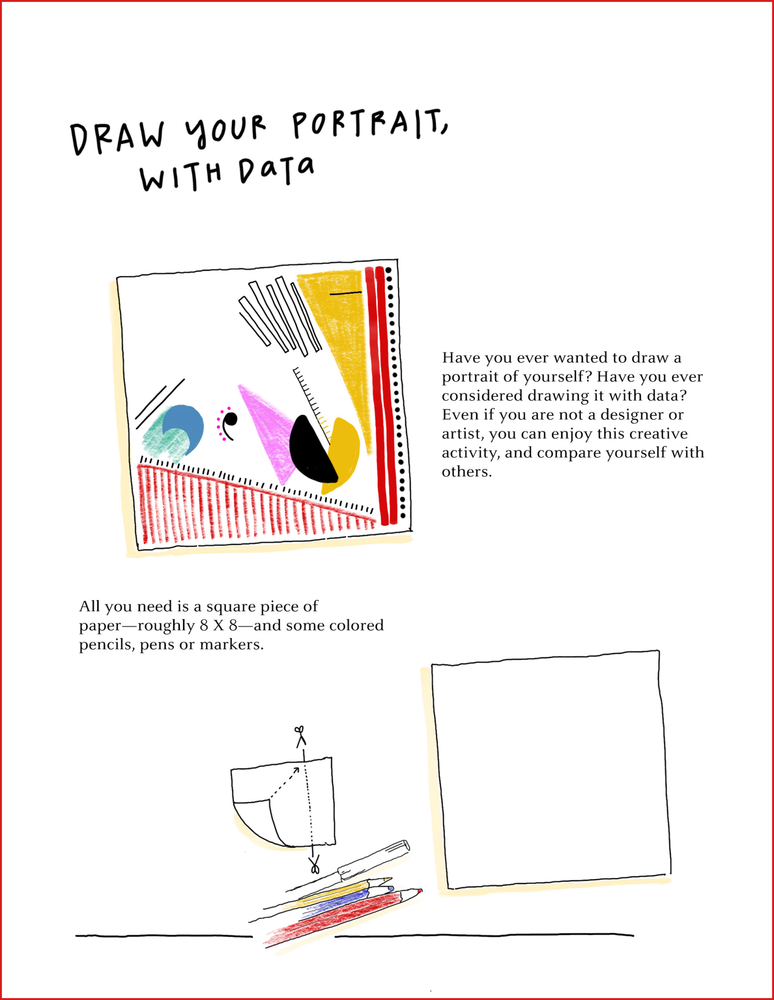

# 绘出自己的数字画像

两位远洋相隔的设计师 [Giorgia Lupi](http://giorgialupi.com/) 与 [Stefanie Posavec](http://www.stefanieposavec.com/) 合作完成一个名为 [Dear Data](http://giorgialupi.com/dear-data) 的有趣项目。她们进行了为期一年内互通信件，但信件内容不是简单的文字或精美的明信片，而是手绘的色彩丰富的数字画像。她们在日常记录下与自己相关的数据，然后用不同的图形元素进行映射，并绘制在一张信纸上，通过这个项目探索数据可视化的表达，她们还有不少 :clapper: [演讲](https://vimeo.com/133608605)介绍这个项目，也出了一本同名的 :books: ​[书](http://giorgialupi.com/dear-data-2)。

[Giorgia Lupi](http://giorgialupi.com/)  在一场名为 :clapper: [How we can find ourselves in data](https://www.ted.com/talks/giorgia_lupi_how_we_can_find_ourselves_in_data/up-next) 的 Ted Talk 演讲中提及了该项目，并在相关文章中介绍了绘制一个关于自我数字画像的步骤，感觉很有趣所以摘录部分内容。

---

:link: 原文：[How to draw your own selfie — using your personal data](https://ideas.ted.com/how-to-draw-your-own-selfie-using-your-personal-data/) - Giorgia Lupi

设计师 Giorgia Lupi 致力于改变人们对于数据的刻板看法，数据并不是冷冰冰的、反应现实的数字，它可以令人感到窝心，但同时要警惕它的缺陷和不全面性。

在大数据时代，很多商业公司都会记录用户使用软件和浏览网页的行为数据，这会让我们忧虑隐私泄露或被这些公司（推荐算法）「操控」。但如果我们借鉴这种思维，主动记录自己日常数据，并用它们来量化自我，从另一个角度讲述自己的故事或许是一件很有趣的事情。

这种思考数据的角度正是 Giorgia Lupi 强调的「[数据人文主义](https://medium.com/@giorgialupi/data-humanism-the-revolution-will-be-visualized-31486a30dbfb)」，将数字与其真正代表的东西关联起来，通过数据讲述其背后的故事，让数据更具生命力和色彩。

> It’s time, she says, “to begin designing ways to connect numbers to what they really stand for: knowledge, behaviors, people.”
>
> She urges to think beyond the hackneyed forms of data visualization — the bar graphs, the linear timelines — and dream up other ways to turn statistics into a story. 

她鼓励大家超越常见的数据可视化形式——条形图、折线图——尝试其他数据可视化方式来讲述故事。类似于由数据构成的自拍照，它是个性化的，从这个层面去评价数字画像，则无绝对的评判好坏的标准。

以下是一个创建数字画像的参考流程：

1. 准备一张白纸和一些彩色笔

   

2. 依此回答一些关于个性的问题，并在纸上画出相应的图形

   

3. 最后得到一张个性化的数字画像

   

   
   
   > **Remember that data, like us, is imperfect.** “It’s time to leave behind any presumption of absolute control and universal truth,” says Lupi. 
   
   虽然数字画像可以反映一部分个性化信息，但它是片面局部的，就像人一样并非十全十美，因此应该避免盲信从可视化图表中简单总结出来是的结论。

---

很多时候我们评价一个数据可视化作品的好坏，会基于一些公认的标准，例如准确性、表达清晰性、有效性等，或许普及率更高的传统的图表从这些评价标准来看是最优的选择，作者为了极力满足这一类的要求往往使得作品变得刻板。

或许情感这一主观的因素也要多尝试融入到一个数据可视化作品中，基于准确性这一底线，「牺牲」一些清晰有效性，尝试让作品更具个性化，毕竟有温度的作品和故事不是比冷冰冰的图表更好吗？

这让我想起在听播客 *海螺电台* 第 16 期[《【海螺壳】构建专属情绪包，从如实记录开始》](https://thespiral.fm/episodes/16) 提到的一款数字化与实体物品结合的产品——心情日历，它是由 [Fireball](https://fireball.studio/) 开发的，用 emoji 贴纸来记录每天的心情，将情绪可视化，就是一款很棒的作品。

最后作者提到的一点尤为重要：==Remember that data, like us, is imperfect.== 应该避免盲信从可视化中得到的结论，因为从数据图表总结的结论的可靠性会受到数据来源真实性、数据覆盖全面性、可视化转换阶段信息失真程度等因素的影响。

> We should embrace these imperfections, just as we embrace imperfections in ourselves and others. These portraits are only the start of forming a new relationship with your data. Once you feel more connected to it, you’ll see it differently. We must treat data “as the beginning of the conversation,” Lupi says, “and not the end.”

当然我们不应该因为数字化无法完全反映真实世界而抛弃这种思考方式，反而应该努力去拥抱她，接受这些不完美，就像我们接受自己和他人的不完美一样。因为多一种思考自我的方式，就多一种认识和挖掘自我多样性的途径。这让我想起在播客 *不可理论* 第 37 期 [《茫茫相似将万物勾连》](https://www.bukelilun.com/episodes/37) 中讨论了 digital 相关话题，值得一听，其中说到人就是 digital 和 anolog 的结合体，这一有趣的见解让人眼前一亮。

说到自我数字量化，其实在当今是越来越普及了，例如常见的各种穿戴设备，它们记录着我们的身体指标。以下列出了一些与数字量化的相关资源，或许后经过深入研究这些实例和技术，结合实践经验写一篇自我量化的博文。

* [Quantified Self](https://quantifiedself.com/) 一个由用户和自我跟踪工具开发者组成的国际社区，他们对「通过数字进行自我认识」感兴趣。
* [RescueTime](https://www.rescuetime.com/) 一个跨平台的时间管理和数字健康工具，可以跟踪用户在系统中的各种行为，分析在不同软件或网页花费的实践，提供 [API](https://www.rescuetime.com/anapi/setup/documentation) 接口。
* [toggl](https://toggl.com/) 另一款实践管理和用户行为跟踪工具。
* [tapiriik](https://github.com/cpfair/tapiriik) 实现各种健身软件数据同步的开源服务
* [MyFitnessPal](https://www.myfitnesspal.com/zh-CN/) 记录餐饮和卡路里应用，提供 [API](https://myfitnesspalapi.com/docs/) 接口
* [TDEE Calculator](https://tdeecalculator.net/) 每日总能量消耗估算器
* [last.fm](https://www.last.fm/zh/) 记录音乐播放的数据，提供 [API](https://www.last.fm/zh/api) 接口
* [Web Scrobbler](https://web-scrobbler.com/) 一款记录在线音乐播放记录的浏览器插件，支持连接 [last.fm](https://www.last.fm/zh/about/trackmymusic)、[libre.fm](https://libre.fm/)、[listenBrainz](https://listenbrainz.org/)
* [Histools](https://github.com/thesephist/histools) 用于分析浏览器历史记录，提供可交互式、可过滤的热图
* [Strava](https://www.strava.com/) 跟踪并分析运动数据

