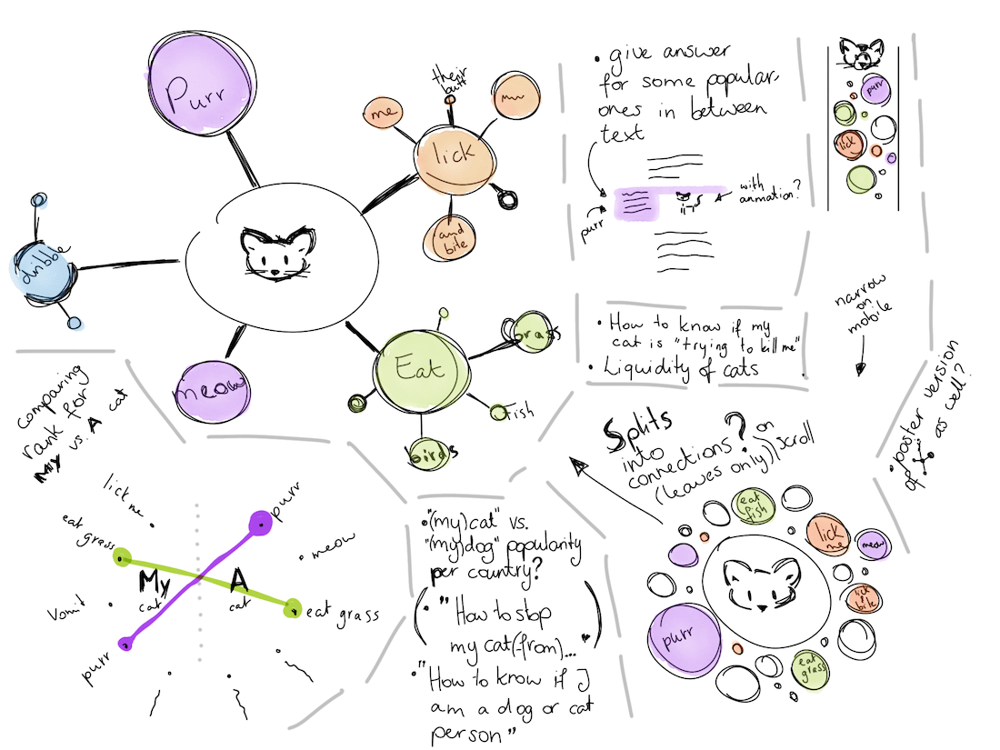
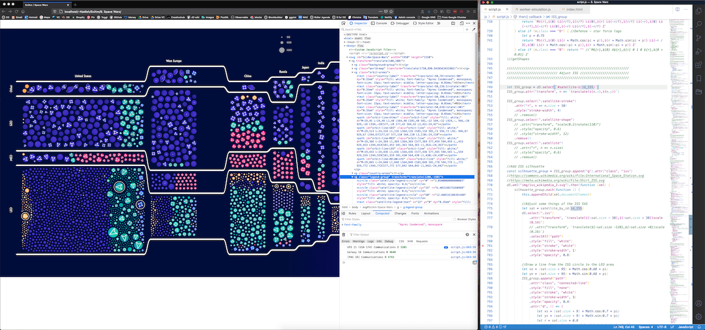

# 数据可视化学习路径及经验

:link: 原文：[Learning Data Visualization](https://www.visualcinnamon.com/resources/learning-data-visualization/) - By Nadieh Bremer

[Nadieh Bremer](https://twitter.com/NadiehBremer) 是从 2017 年开始成为一名自由职业的数据可视化设计师，她在个人[博客](https://www.visualcinnamon.com/)上发表了一篇数据可视化学习历程的[博文](https://www.visualcinnamon.com/resources/learning-data-visualization/)，对于数据可视化的入门起步方法、学习方向、学习资源都有介绍。

### 寻找方向

数据可视化其实是一个较广泛的领域，其中有不同的细分方向，使用的方法论和工具都不同，对于初学者应该广泛涉猎，以寻找到自己热衷的可视化方式。

找到了想去尝试的方向，互联网有很多资源可以跟着入门教程做一些项目，在这过程中会遇到不少问题，可以通过 [StackOverflow ](https://stackoverflow.com/) 等站点解决。

### 最佳实践

在学习过程中需要找到**最佳实践**方式，而不能靠自觉，虽然实现方式有多种，基于「在打破规则之前先了解规则」的思路，遵循最佳实践才可以创作出更佳的作品。

> know the rules before you break them

作者提到最佳实践的建议大部分都从**书籍**中获得，因为编纂成书的内容大部分都是经过专家审阅的，此外她还专门有一篇文章 [Data Visualization Book Reviews](https://www.visualcinnamon.com/resources/learning-data-visualization/books/) 持续更新介绍自己读过与数据可视化相关的优质书籍。

### 不断创作

> If there was only one tip that I could give, it would be this; **create, create, create**.

对于学习没有捷径，作者觉得唯一的建议就是**不断创作**，通过不断的实战才可以提升技能、习得经验。初期可以模仿复刻，或进行小幅度的再创作  *remix*，例如使用一样的方法但套用自己的数据集，改变视觉元素，整合之前的经验，不断优化。

学习并非坦途，所以**挑选自己感兴趣的主题**进行创作才可以有更大的动力，才有激情进行持续优化，而且对于数据的洞察会更全面、更独特，对于数据展示方式才有更多的灵感。但有时候自己感兴趣的主题并不容易获得数据，但是只要有心，总会在可能的地方找到数据的，可以搜索 Github 看看别人的项目，或者自己动手来收集。

:bulb: 别忘了记得及时更新自己的作品集和简历，把过时或觉得自己不再使用的技术剔除出去。

### 设计技能 VS. 数据技术

由于数据可视化的基础是**数据**，因此夯实数据分析处理能力很重要。作者推荐学习著名大学的MOOC 课程，如 Harvard 在 edX 上的 :memo: [Data science](https://www.edx.org/course/subject/data-science) 课程。如果对于数据还感到恐惧，作者极力推荐阅读 :books: *[Truthful Art](https://www.amazon.com/gp/product/0321934075/ref=as_li_qf_asin_il_tl?ie=UTF8&tag=visuacinna-20&creative=9325&linkCode=as2&creativeASIN=0321934075&linkId=3c91978e69d6ab9794431c1d6a9015bd)*

:bulb: 数据处理工具作者极力推荐学习 :hammer: [R](https://www.r-project.org/) 和 :hammer: [python](https://www.python.org/)，以对数据进行正确的清洗和统计分析。python 适用场景更广泛，而 R 则更易上手。

对于设计技能，作者通过收集好的作品来获取灵感，从中解构获得所需的设计元素，例如她会为项目创建一个 [Pinterest 面板](https://www.pinterest.com/nadiehbremer/)，将尽可能多的相关的作品或素材放进去。

### 创作流程

1. 理解数据：与客户沟通，了解他们的目的；在前期探索可视化方式时，尽可能使用真实数据（或小规模的 sample），而不是使用模拟数据。

2. 绘制草图：手绘草图进行初期的设计，作者使用 :hammer: [Tayasui Sketches](https://tayasui.com/sketches/) 软件进行绘制，并与初步的数据探索相结合，可以先尝试简单的形式（如条形图、直方图、折线图、散点图等，作者一般使用 R 的 :hammer: [Tidyverse](https://www.tidyverse.org/) 或 :hammer: [ggplot2](https://ggplot2.tidyverse.org/) 包来生成常见的可视化图表），以寻找合适的数据可视化方式。然后就可以基于草图与客户沟通，不断迭代，最后决定采用何种可视化方式。

   :bulb: 草图不需要特别精准，因为 datavis 是与数据结合的，最后需要接入数据才起效果，草图设计阶段只需要定性或部分定量即可，如采用何种可视化形式，是否需要连线，而不必要特别在意颜色，交互效果等细节。

   

   以上就是作者在为 Google News Lab 创作的 *[Why do Cats and Dogs...?](https://whydocatsanddogs.com/)* 时绘制的设计草图

3. 创作可视化：作者推荐使用编程的方式将数据和可视元素进行连接和映射，因为这样创作生成的可视化作品更容易进行编辑和更新迭代，一般通过更新数据源即可响应式地更新视图层的元素。创作初期只是将数据映射到可视化元素上，效果可能很差，这需要不断地优化打磨，在该过程中可以与客户多交流，听取他们的反馈并不断迭代，以保证最后得到一个大家都满意的结果。

   :bulb: 作者的开发环境和技术栈

   * 编辑器：[Visual Studio Code](https://code.visualstudio.com/)
   * 调试工具：[Chrome](https://developers.google.com/web/tools/chrome-devtools) 或 [Firefox](https://developer.mozilla.org/en-US/docs/Tools) 的 devTools
   * 开发框架：[D3.js](https://d3js.org/)（制作图表可能很繁琐，但是灵活性和可定制化程度极高）

   

   作者一般在 38-inch 的显示器上将浏览器和 VS Code 以左右布局的方式来进行开发

   :bulb: 前端可视化最后采用的技术都是落到 SVGs、HTML5 Canvas、webGL 之中，它们各有优势和缺点，需要基于数据集和可视化形式来选用。

---

:bulb: 数据可视化的成果最后以可视形式展现，因此创建一个自己的作品集 portfolio 网站很重要，它可以成为自己的一张名片，还可以吸引更多的客户。作者通过创建 [datasketch](https://www.datasketch.es/) 项目展示自己的作品，收获了不少客户。

:bulb: 另外她写了一篇[博文](https://www.visualcinnamon.com/2017/03/my-journey-into-dataviz/)讲述早期如何从从研究天文学到成为转型成为一名自由职业的数据可视化设计师的过程

